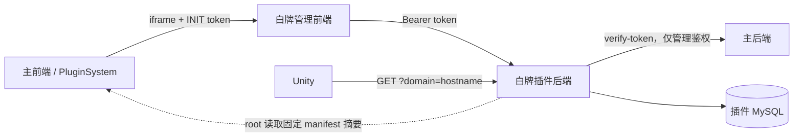

# 架构与权限

## 核心决策

白牌只由当前 hostname 决定，组织不是白牌维度。配置键和配置内容拥有不同来源：

```text
主前端 manifest（只读） -> configKey + description
root 手工编辑             -> 独立白牌 JSON
                         -> 插件 MySQL
Unity domain 请求         -> 按 configKey 匹配 -> 原样 JSON
```

主前端 manifest 是键命名空间，不是插件内容仓库。插件永远不复制或同步其中的 JSON。

## 组件关系



- 管理运行时与公开解析运行时分离；
- 公开解析只依赖插件 MySQL；
- 插件不接收 organizationId、用户 ID、loginKey 或 assignment；
- `yii3-a1` 不读取插件数据库，也不代理白牌配置。

## 数据模型

| 字段 | 含义 |
|---|---|
| `id` / `domainId` | 管理端内部 ID |
| `domain` / `configKey` | 从只读目录选择的匹配键，创建后不可修改 |
| `display_name` | 创建时保存的目录说明，仅用于管理列表 |
| `config_json` | root 自行填写的独立公开 JSON，原样保存和返回 |
| `schema_version` | 当前固定为 1 |
| `revision` | 乐观锁版本 |
| `is_enabled` | 插件运行态开关 |
| 审计字段 | 创建、更新、启停的用户与时间 |

`config_json` 没有业务 Schema，只要求根为 JSON object 并满足安全限制。`name` 可以是
`"主站"`；它不与 `configKey` 比较。编辑内容不会修改 `display_name` 或 `configKey`。

已有记录不做破坏性迁移：原 `config_json` 的所有字段继续保留并按新规则原样返回。

## hostname 解析

请求必须显式传 `domain`。服务端不使用 HTTP `Host`、Origin、Referer 或
`X-Forwarded-Host` 决定白牌。

`d.dev.xrugc.com` 的候选为：

```text
d.dev.xrugc.com
dev.xrugc.com
xrugc.com
```

取第一条存在的记录。若它被 `is_enabled` 停用，返回 `{}`，不继续父域。JSON 内容字段
不参与匹配或启停。所有候选不存在时返回 `{}`，不尝试 `default`。

## 权限

| 操作 | root | admin | 未登录 |
|---|---:|---:|---:|
| 查看域名列表和详情 | 是 | 是 | 否 |
| 创建、编辑、启停 | 是 | 否 | 否 |
| 读取主前端只读键目录 | 是 | 否 | 否 |
| 调用公开 resolver | 是 | 是 | 是 |

当前没有域名管理员 ACL，因此 admin 不能按组织获得写权限。

## 缓存与失败

- ETag 由实际响应 JSON 计算；
- `no-cache, must-revalidate` 要求每次应用前重验证；
- 主后端故障会关闭管理操作，但不影响公开解析；
- Unity 应保存 last-known-good，远端失败不能阻塞登录或启动。
