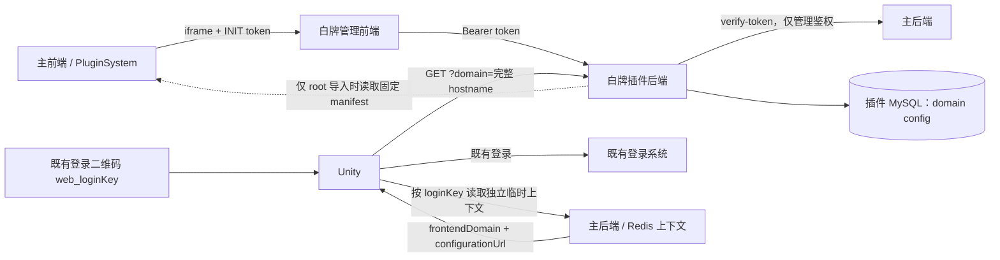

# 架构与权限

## 1. 决策

白牌配置只由当前主前端的完整 hostname 决定。组织不是白牌维度，也不是白牌授权
条件。

设计优先级：

1. 同一个域名在任何账号登录后得到同一份白牌配置；
2. 登录、账户组织和白牌解析分别拥有独立上下文；
3. 主前端和主后端只传递必要的 hostname 与服务地址，不理解配置键匹配、JSON Schema
   或白牌启停规则；
4. 白牌插件自行管理快照、匹配、校验、缓存和审计；
5. 对未知、非法或明确停用的域名失败关闭，避免套用错误品牌。

## 2. 组件关系



### 白牌插件

- 只拥有 `white_label_domain_config`；
- 不接收 `organizationId`、用户 ID、loginKey 或 assignment；
- 管理接口使用主平台 Bearer token 做 root/admin 鉴权；
- 公开接口不鉴权，因为配置本身被定义为公开运行时数据；
- 运行时只访问自己的 MySQL，不依赖主前端、主后端、Redis 或 `yii3-a1`；
- 主前端 manifest 只是一键导入来源，不是运行时配置源。

### 主前端与主后端

- 主前端继续使用原插件 iframe 协议，不新增白牌业务页面；
- 既有登录二维码格式保持 `web_<loginKey>`；
- 单独的临时登录上下文可包含当前前端 hostname、当前账户组织以及配置服务 URL；
- 组织只供账户或其他业务使用，白牌插件不消费它；
- 主前端可从已注册服务元数据提交配置服务 URL；主后端只做 HTTPS allow-list 校验并
  将其作为不透明字符串保存，不拼接配置键、不查询插件数据库；
- 上下文接口和 Redis 生命周期属于登录系统，不在本插件实现。

### yii3-a1

- 保持现有登录职责；
- 不生成额外 `clientContextToken`；
- 不读取白牌插件数据库，也不代理白牌配置；
- 新客户端在完成原登录步骤之外，独立读取登录上下文和白牌服务。

## 3. 数据模型

### `white_label_domain_config`

表中一行代表一个主前端静态配置键/域名族，而不是每一个精确 hostname。

| 字段 | 含义 |
|---|---|
| `id` / `domainId` | 管理端内部数字 ID，不进入公开协议 |
| `domain` / `configKey` | `config_json.name` 的数据库唯一投影 |
| `display_name` | `config_json.description` 的只读投影 |
| `config_json` | 完整、自包含的 `StaticDomainConfig` 快照 |
| `schema_version` | 当前只接受 1 |
| `revision` | 乐观锁与缓存版本 |
| `is_enabled` | 是否允许公开解析 |
| 审计字段 | 创建、更新、启停的用户与时间 |

`config_json` 是权威数据；服务端在写入时同步 `domain` 与 `display_name`。修改
`config.name` 不改变内部 `domainId`。

域名 JSON 结构：

```json
{
  "name": "dev.xrugc.com",
  "description": "XR UGC Dev",
  "is_active": true,
  "fallback_domain": "default",
  "default_config": {},
  "configs": {
    "zh-CN": {}
  }
}
```

- `name` 必须等于 API 的 `configKey`；
- `fallback_domain` 仅保留主前端格式兼容语义；
- 保存的快照必须已物化 Unity 所需内容，运行时不递归读取 fallback；
- JSON 不能包含认证凭据或秘密。

### 旧表兼容

旧版数据库可能仍有：

- `white_label_organization_config`；
- `white_label_assignment`。

新代码完全不读写这两张表。切换时不执行 `DROP`、`DELETE` 或自动合并；现有数据留作
审计与回滚。新安装的 `schema.sql` 只创建域名表。确认生产迁移和备份策略后，才能在
独立运维变更中归档旧表。

组织 JSON 不能自动合入域名 JSON：多个组织可能曾连接到同一个域名，但新模型只能
有一份域名配置。若旧组织内容仍有价值，必须由业务负责人明确选择字段并人工迁移。

## 4. hostname 解析

公开请求必须显式传 `domain`。服务端不使用 HTTP `Host`、`Origin`、Referer 或
`X-Forwarded-Host` 决定白牌。

规范化：

1. trim；
2. 删除一个 DNS 尾点；
3. 转为小写 ASCII/Punycode；
4. 校验总长度与每个 DNS label；
5. 拒绝 scheme、路径、查询、fragment、端口、userinfo、通配符和空 label。

候选顺序与主前端 `domain-static-config.ts` 保持一致：

```text
d.dev.xrugc.com
  1. dev.xrugc.com
  2. xrugc.com
  3. d.dev.xrugc.com
```

`www.` 也会先去前缀并逐级尝试父域名。候选按首次出现去重，数据库只做参数化精确
匹配，不使用 `LIKE` 或无边界后缀匹配。

解析规则：

- 取候选顺序中第一条“存在的”记录；
- 该记录只有在 `is_enabled = 1` 且 `config.is_active = true` 时返回；
- 首条记录存在但停用时立即 404，不继续回退；
- 所有非 default 候选均不存在时，可尝试配置键 `default`；
- `default` 也必须由 root 显式保存并启用；
- 没有可用结果时统一 404。

这让停用操作成为可靠的品牌熔断，同时保留主前端现有的域名族语义。

## 5. 权限模型

| 操作 | root | admin | 未登录 |
|---|---:|---:|---:|
| 查看域名列表和详情 | 是 | 是 | 否 |
| 创建、编辑、启停 | 是 | 否 | 否 |
| 读取主前端导入清单 | 是 | 否 | 否 |
| 调用公开 resolver | 是 | 是 | 是 |

管理后端逐请求验证 Bearer token。前端隐藏按钮只是体验优化，不能替代后端权限。

当前没有“admin 属于哪些域名”的权威关系，因此不能让 admin 按组织或当前 hostname
获得写权限。未来如果增加域名管理员 ACL，它只影响管理 API，绝不能改变相同 hostname
的公开解析结果。

## 6. 响应、缓存与失败

公开响应只包含一份域名配置：

```json
{
  "version": 1,
  "domain": {
    "requestedDomain": "d.dev.xrugc.com",
    "configKey": "dev.xrugc.com",
    "isDomainFallback": true,
    "revision": 5,
    "schemaVersion": 1,
    "config": {}
  }
}
```

- ETag 必须随实际响应内容及域名 revision 变化；
- 响应允许缓存供 ETag 复用，但使用 `no-cache, must-revalidate` 要求每次应用前重新
  验证；`If-None-Match` 命中返回 304，停用不会被旧 freshness 窗口延迟；
- 非法、未知、停用统一 404，不暴露匹配过程；
- 主后端故障时管理请求失败关闭，但公开解析不受影响；
- Unity 成功后保存 ETag 和 last-known-good；网络错误优先使用 last-known-good，404
  使用内置默认配置；
- 白牌失败不能改变登录成功与否。
