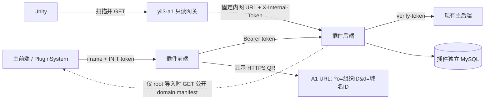

# 架构与权限

## 1. 设计原则

本设计按以下顺序取舍：

1. **业务身份正确**：组织代表账号购买方，域名配置键/域名族代表产品代理方；
2. **配置完全分离**：双方各自维护一份 JSON，不复制、不合并、不覆盖；
3. **权限边界明确**：admin 只管理当前会话所属组织，root 管理代理域名和组合；
4. **低耦合**：主前端和主后端不承载白牌业务，A1 只做只读网关；
5. **失败安全**：任何一侧或组合无效时都不返回半份配置。

“域名”不是浏览器本次请求的精确 hostname。它是与主前端静态配置文件名一致的
`configKey`，代表一组可以命中同一配置的域名。例如主前端按候选域名逐级查找时，
`d.dev.xrugc.com` 会命中 `dev.xrugc.com`。插件同时为每条记录分配自己的数字
`domainId`，作为组合外键和二维码短索引。

## 2. 组件关系



### 主前端

- 只通过现有插件系统加载 iframe；
- 继续使用 `PLUGIN_READY -> INIT`、token 更新、主题和语言协议；
- 不新增白牌页面、业务路由或白牌状态；构建时只把已有公开域名 JSON 汇总为
  `/config/domains/manifest.json`；
- `web/src/api/domain-static-config.ts` 及 `web/public/config/domains/*.json` 仍是
  数据结构和匹配语义的权威来源；插件只在 root 主动导入时读取清单，永不写入；
- 如果配置也需要在主前端生效，必须在主前端仓库单独增加
  `web/public/config/domains/{configKey}.json` 并发布主前端。

### 主后端

- 不新增白牌表、控制器或写入逻辑；
- 现有 `GET /v1/plugin/verify-token` 提供用户、角色和组织数组；
- 可由前端使用现有组织列表接口提供 root 的组织选择；
- 管理链路依赖主后端校验；Unity 读取链路不经过主后端。

### 插件后端

- 拥有三张白牌业务表、所有校验、审计和启停状态；
- 每次管理请求都校验主平台 Bearer token，失败时关闭写操作；
- 不信任前端提交的角色、用户 ID 或组织权限；
- 两份 JSON 的字段名限制为可审计的 ASCII 标识符，并递归拒绝认证、token、密码、
  私钥和连接串等敏感字段；
- 向 A1 暴露固定 token 保护的内部只读解析接口。
- 可从部署时固定的主前端 HTTPS origin 读取 root-only 导入清单；浏览器不能指定
  URL，清单不可用也不会影响健康检查、CRUD 或 Unity 解析；
- 域名配置以完整 `StaticDomainConfig` JSON 独立存储，`config.name` 派生
  `configKey`，`config.description` 派生只读显示名；不保存当前访问 host。

### yii3-a1（待接入）

- 公开 `GET /v1/white-label-configs?o={organizationId}&d={domainId}`；
- 只接受两个正整数 ID；
- 内部服务地址来自部署环境变量，不从二维码 host 或请求参数构造；
- 只转发允许的 JSON、ETag 和 Cache-Control；
- 404 原样归一，其余上游异常返回不泄漏细节的 503。

以上是目标接口契约。当前 `yii3-a1` 白牌路由仍是草案且尚未部署，不能把二维码 URL
描述为已经可访问的线上能力。不存在也不创建 `yii3-a3`；最终公开读取入口使用
`yii3-a1`。

## 3. 权限模型

| 操作 | root | admin |
|---|---:|---:|
| 查看全部组织配置 | 是 | 否 |
| 创建、编辑、启停自己组织的 JSON | 是 | 是 |
| 从主前端清单导入域名 JSON | 是 | 否 |
| 创建、编辑、启停域名 JSON | 是 | 否 |
| 创建、启停组织 × 域名组合 | 是 | 否 |
| 查看自己组织的组合和二维码 | 是 | 是 |

admin 可以属于多个组织。后端将 `verify-token` 返回的全部
`organizations[].id` 组成 allow-list：

- 查询在 SQL 层限制到 allow-list；
- 创建和修改必须命中 allow-list；
- 路径 ID、请求体和前端显示值都不能扩大范围；
- admin 被移出组织后，下一次请求立即失去权限；
- 多个 admin 编辑同一组织时由 `revision` 防止后写覆盖先写。

插件数据库不保存用户属于哪些组织，避免复制主平台的身份关系。

## 4. 数据模型

### `white_label_organization_config`

购买账号的购买方配置，每个主平台组织最多一条。

| 字段 | 含义 |
|---|---|
| `organization_id` | 主平台数字组织 ID，唯一且作为外部索引 |
| `organization_name` | 组织 slug 快照 |
| `organization_title` | 显示名称快照 |
| `schema_version` | 组织 JSON 契约版本 |
| `revision` | 乐观锁版本 |
| `config_json` | 购买方独立 JSON |
| `is_enabled` | 是否可参与 Unity 解析 |
| 审计字段 | 创建、更新、启停用户及时间 |

### `white_label_domain_config`

代理产品的代理方配置。表名沿用“domain”，但业务主键语义是主前端静态域名配置键，
不是一个精确 hostname。

| 字段 | 含义 |
|---|---|
| `id`（API 为 `domainId`） | 插件生成的数字域名 ID，二维码外部索引 |
| `domain`（API 为 `configKey`） | 由 `config_json.name` 派生的静态域名配置键，全局唯一 |
| `display_name` | 由 `config_json.description` 派生的只读显示名称 |
| `schema_version` | 域名 JSON 契约版本 |
| `revision` | 乐观锁版本 |
| `config_json` | 与主前端 `StaticDomainConfig` 同结构的代理方独立快照 |
| `is_enabled` | 是否可参与 Unity 解析 |
| 审计字段 | 创建、更新、启停用户及时间 |

域名记录不硬删除。修改 `config.name` 会更新 `configKey`，但保留相同的数字
`domainId`，所以二维码不需要暴露配置键。配置键表示域名族：主前端的匹配器可能让
多个请求 hostname 命中它，例如 `d.dev.xrugc.com` 和 `dev.xrugc.com` 都可命中
`dev.xrugc.com`。

插件中的快照和主前端静态文件没有运行时同步关系。root 可把清单中的一项完整复制
进编辑器，但保存后不会跟随主前端变化。若要让主前端识别一个新键，需要另行创建并
发布 `web/public/config/domains/{configKey}.json`；仅在插件创建记录不会改变主前端
行为。

### `white_label_assignment`

只表达允许的购买方 × 代理方组合，不保存 JSON。

| 字段 | 含义 |
|---|---|
| `id`（API 为 `assignmentId`） | 内部数字主键 |
| `organization_id` | 购买方组织 ID |
| `domain_id` | 代理域名 ID |
| `revision` | 乐观锁版本 |
| `is_enabled` | 组合是否可解析 |
| 审计字段 | 创建、更新、启停用户及时间 |

`organization_id + domain_id` 唯一。只有组合、组织配置和域名配置三者都启用时，
Unity 才能取得结果。

## 5. 两份 JSON

服务端永远不合并两个 JSON，也不建立字段覆盖优先级：

```json
{
  "version": 1,
  "organization": {
    "id": 42,
    "name": "buyer-a",
    "title": "购买方 A",
    "schemaVersion": 1,
    "revision": 3,
    "config": {}
  },
  "domain": {
    "id": 8,
    "configKey": "dev.xrugc.com",
    "schemaVersion": 1,
    "revision": 5,
    "config": {
      "name": "dev.xrugc.com",
      "description": "XR UGC Dev",
      "is_active": true,
      "fallback_domain": "default",
      "default_config": {},
      "configs": {}
    }
  }
}
```

Unity 分别解析 `organization.config` 和 `domain.config`。两份 JSON 都只能包含运行时
公开配置；包名、签名、原生图标和版本号仍属于构建期属性。

### JSON Schema 与编辑器

组织 JSON 和域名 JSON 使用两个独立、随插件版本管理的 Schema，不共享字段定义：

- 组织 Schema v1 当前只要求顶层为 JSON object，并继续执行大小、深度、字段名和
  敏感键检查；购买方格式固定后可以独立收紧；
- 域名 Schema v1 对齐主前端 `StaticDomainConfig`：`name` 必填且等于
  `configKey`，`description` 是显示名称，`is_active` 为 boolean，
  `fallback_domain` 为 string 或 null，`default_config` 为 object，`configs` 是
  语言到 object 的映射；
- 域名快照必须自包含。`fallback_domain` 是格式兼容元数据，不是 Unity 读取链路；
  插件、A1 和 Unity 不按它递归请求其他配置，纯外部 fallback 且自身内容为空的文档
  会被拒绝。导入这类主前端文件时必须先物化所需有效内容；
- 管理界面中的共享 JSON 编辑器提供语法高亮、行号、格式化、压缩、语法诊断和
  Schema 诊断。任一校验失败时禁止提交。

Schema 只约束各自 JSON，不会把组织字段复制进域名 JSON，或把域名字段复制进组织
JSON。需要让 root 动态编辑 Schema 时应另做有审计、版本迁移和兼容策略的功能，
不属于当前最小实现。

当前两侧都只实现 `schemaVersion: 1`。服务不会接受尚无验证器和 Unity 消费契约的
任意未来版本；新增版本时必须先增加对应验证、迁移和客户端支持。

## 6. 失败与缓存

- 任一 ID 非法、记录不存在、任一配置停用或组合停用：统一 404；
- 插件后端不可用或响应契约错误：A1 返回 503；
- ETag 同时包含组合、组织和域名 revision；
- If-None-Match 命中返回 304；
- Unity 成功后保存 last-known-good；
- 404 回退内置默认值，网络错误或 503 优先回退 last-known-good；
- 绝不应用只有组织或只有域名的半份配置。
