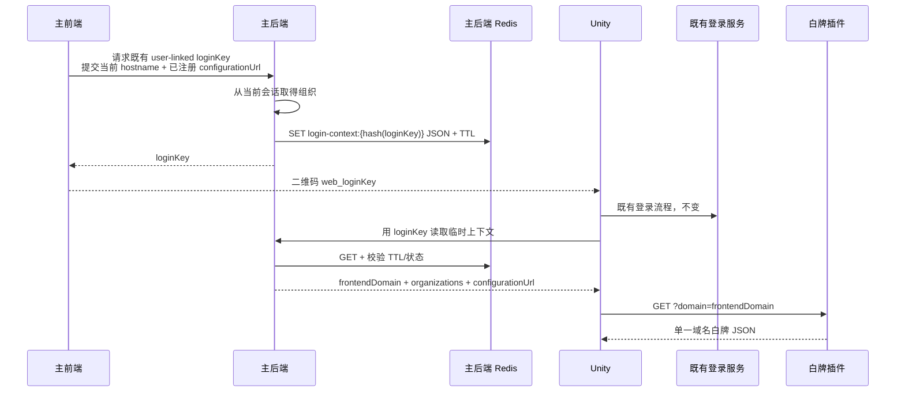

# 登录上下文与 Unity 接入

## 1. 兼容目标

既有登录二维码保持完全不变：

```text
web_<loginKey>
```

旧客户端继续只把它当作登录码。新客户端在执行相同登录流程之外，可用同一个
`loginKey` 读取一份临时客户端上下文，再根据其中的 hostname 调用白牌插件。

这个上下文属于主登录系统，不属于白牌插件。本文定义边界，当前插件仓库不实现主
后端接口或 Redis 写入。

## 2. 两个互不混合的上下文

### 登录/客户端上下文

由主后端按 loginKey 临时保存，可包含：

```json
{
  "version": 1,
  "frontendDomain": "d.dev.xrugc.com",
  "organizations": [
    {
      "id": 42,
      "name": "buyer-a",
      "title": "购买方 A"
    }
  ],
  "configurationUrl": "https://whitelabel-d.plugins.xrugc.com/v1/white-label-configs",
  "expiresAt": "2026-08-01T10:00:00.000Z"
}
```

- `frontendDomain`：主前端使用 `window.location.hostname` 提供，主后端只做 hostname
  规范校验，不推导白牌配置键；
- `organizations`：主后端根据已登录账户权威生成，供 Unity 的账户业务使用；
- `configurationUrl`：主前端从已注册插件/服务元数据中取出并原样提交；主后端不解析
  白牌协议，但必须要求它精确命中服务端 HTTPS allow-list，不能保存任意请求 URL；
- `expiresAt`：与登录码有效期一致或更短。

### 白牌上下文

只有完整域名：

```http
GET <configurationUrl>?domain=<frontendDomain>
```

白牌插件只接收 `domain`，自行决定 `configKey` 并返回一份 JSON。组织数组绝不能转发
给插件，也不能影响匹配结果。

## 3. 建议时序



上下文读取可以发生在登录交换前或后，但主后端必须沿用 loginKey 的同一有效期、状态
和重放策略。不能为了白牌再生成第二个二维码或改变 `web_` 前缀。

## 4. loginKey 的职责

loginKey 仍由现有主后端 user-linked 流程生成。白牌插件：

- 不生成 loginKey；
- 不保存 loginKey；
- 不验证 loginKey；
- 不读取 `user_linked` 表；
- 不访问主后端 Redis；
- 不用 loginKey 作为白牌缓存键。

`yii3-a1` 保持现有 loginKey 登录能力，不生成新的 context token，也不调用白牌插件。
上下文是主后端对既有 key 的附加只读信息。

## 5. Redis 建议

推荐只保存 loginKey 的哈希，不保存明文：

```text
login-context:v1:<sha256(loginKey)>
```

值为版本化 JSON，并设置与二维码相同或更短的 TTL。创建新 loginKey、登录码过期、
撤销或被消费时，应同步使上下文不可用。

上下文不能包含 access token、refresh token、数据库凭据或白牌 JSON。它只传递客户端
下一步所需的非秘密定位信息和账户摘要。

## 6. 旧客户端与失败策略

| 场景 | 行为 |
|---|---|
| 旧 Unity | 只执行原登录，完全忽略上下文 |
| 新 Unity，上下文成功 | 登录后继续读取域名白牌 |
| 上下文缺失/过期 | 登录结果不受影响，使用内置或 last-known-good 白牌 |
| 白牌 404 | 使用内置默认白牌，不回退到其他组织 |
| 白牌网络错误 | 优先使用 last-known-good |
| 白牌成功 | 校验 Schema，原子应用并缓存 ETag |

白牌配置永远不能决定用户是否登录成功。组织信息也不能决定同一域名返回哪一份白牌。

## 7. 安全检查

- 主前端只能提交 hostname，不提交 `o`、`d` 或配置键；
- 主后端从认证会话生成组织，不信任前端提交组织；
- `configurationUrl` 可由主前端从已注册服务元数据提交，但主后端必须限定 HTTPS
  allow-list；
- 上下文接口避免在日志记录明文 loginKey；
- Redis key 使用哈希并设置 TTL；
- Unity 对 `configurationUrl` 做允许域名校验；
- 白牌插件拒绝 URL、端口、userinfo、路径和额外查询参数；
- 任何上下文或白牌失败都不能削弱原登录安全策略。
